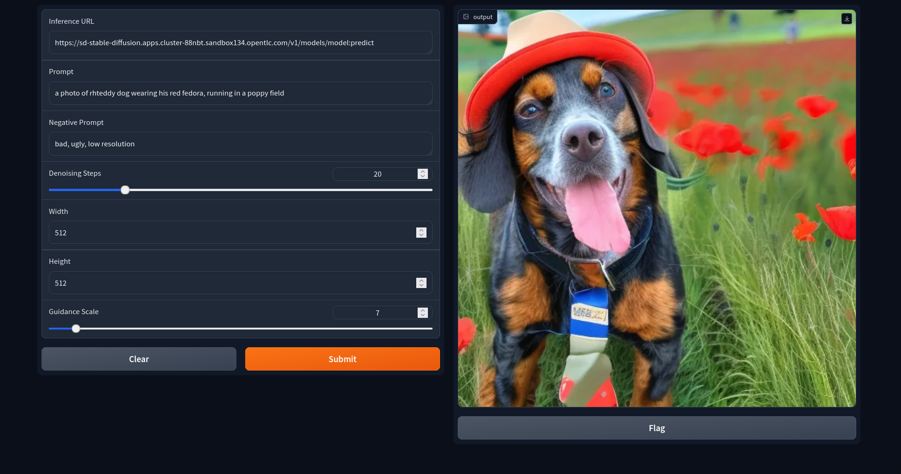

# Text To Image Demo Frontend

This is the frontend application for the [Text To Image Stable Diffusion Demo](https://github.com/mcaimi/text-to-image-demo)
It exposes a way to perform inference with a Stable Diffusion compatible model in the backend.

It is built with FastAPI and Gradio and works both locally (in a virtual environment for example) or inside Openshift.
It has however a dependency on the KServe model server engine that runs in OCP AI. Look [here](https://github.com/mcaimi/kserve-diffusers-demo) for the backend code.

